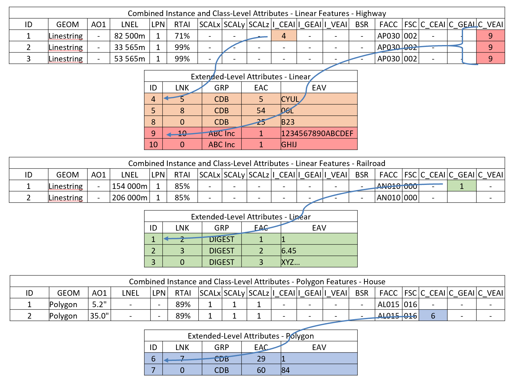

== Flattening the Schema
The CDB Shapefile standard provides three attribution schemas to represent attribution data.  Those three have been flattened into two for use with GeoPackage.  

•	Instance-level attribution schema
•	Extended-level attribution schema

As CNAM in the CDB Shapefile schema was only used as a relationship field, it has been removed from the flattened schema. Figure 1 shows the flattened instance and class-level attributes, and how the extended attributes link to a feature. I_CEAI, I_GEAI, and I_VEAI are all instance-level attributes and are linked to a specific feature.  C_CEAI, C_GEAI, and C_VEAI are all class-level attributes and are linked to all features in a layer.

[#img_CDBGpkgFlattenedSchema,reftext='{figure-caption} {counter:figure-num}']
*{figure-caption}{counter:figure-num}. CDB GeoPackage Flattened Schema*

Example: 
Record ID 4 in the extended-level attributes table is related to record ID 1 in the linear features table and is an instance-level attribute.  Record IDs 5 and 8 are also linked to record ID 4, and all apply to the same linear feature.  Note that a 0 in the LNK column denotes the end of the applicable record list. 
Record 9 in the extended-level attributes table is a class-level attribute related to all features that are present in the highway layer.

All of the information that is needed to instance features is organized in accordance to the CDB tile structure.  All the tiled GeoPackage dataset files are located in the same directory. The dataset’s second component selector (CS2) is used to differentiate between files with the same extension or with the same Vector features.  Table 1 presents the list of codes that are allocated.  Note that Vector datasets do not necessarily use all of the Dataset Component Selector 2 reserved codes.  Users of the CDB standard should refer to the appropriate section for an enumeration of the supported File Component Selector 2 codes as well as the ones specific to the Dataset.

The Vector dataset concept and the feature code concepts overlap somewhat; some of the Vector datasets are generalizations or specializations of feature codes.  Note that the same feature should not have two representations.

Table 1: Component Selector 2 for Vector Dataset File Names
[option="header"]
|===
|*CS2* | *File Extension* |	*Dataset Component Name* |	*Supported Shape Type*
|001	| *.gpkg |	Point features	| Point, PointZ, PointM, MultiPoint, MultiPointZ, MultiPointM
|003	| *.gpkg	| Lineal features	| PolyLine, PolyLineZ, PolyLineM
|005	| *.gpkg	| Polygon features	| Polygon, PolygonZ, PolygonM, Multipatch
|007	| *.gpkg	| Lineal figure point features	| Point, PointZ, PointM, MultiPoint, MultiPointZ, MultiPointM
|009	| *.gpkg	| Polygon figure point features	| Point, PointZ, PointM, MultiPoint, MultiPointZ, MultiPointM
|011	| *.gpkg	| 2D relationship tile connections	| N/A
|015	| *.gpkg	| 2D relationship dataset connections	| N/A
|===

Table 2: Component Selector 2 for Vector Dataset Table Names
[options="header"]
|===
|*CS2* | *Dataset Component Name* | *Supported Shape Type*
|001	| Point features |	Point, PointZ, PointM, MultiPoint, MultiPointZ, MultiPointM
|002	| Point feature class-level attributes	| N/A
|003	| Lineal features	| PolyLine, PolyLineZ, PolyLineM
|004	| Lineal feature class-level attributes	| N/A
|005	| Polygon features	| Polygon, PolygonZ, PolygonM, Multipatch
|006	| Polygon feature class-level attributes	| N/A
|007	| Lineal figure point features	| Point, PointZ, PointM, MultiPoint, MultiPointZ, MultiPointM
|008	| Lineal figure point feature class-level attributes	| N/A
|009	| Polygon figure point features	| Point, PointZ, PointM, MultiPoint, MultiPointZ, MultiPointM
|010	| Polygon figure point feature class-level attributes	| N/A
|011	| 2D relationship tile connections	| N/A
|012	| Deprecated	| N/A
|013	| Deprecated	| N/A
|014	| Deprecated	| N/A
|015	| 2D relationship dataset connections	| N/A
|016	| Point feature extended-level attributes	| N/A
|017	| Lineal feature extended-level attributes	| N/A
|018	| Polygon feature extended-level attributes	| N/A
|019	| Lineal Figure Point extended-level attributes	| N/A
|020	| Polygon Figure Point extended-level attributes	| N/A
|===

== Layer Names within a GeoPackage

Each GeoPackage file shall contain one and only one feature table. The feature table shall include all attributes (fields) required by the CDB standard (Volume 1, 5.7.1.2. CDB Attribution). The single feature table shall be named identically to the GeoPackage filename (not including the ".gpkg" filename extension). A GeoPackage file may include an optional extended level attribute table. The extended level attribute table shall not contain geometry. The name of the extended level attribute table shall use the CS2 selector shown in Table 2. Table 3 shows the file naming convention.

Table 3: Tiled Dataset File Naming Convention 1
[options="header"]
|===
|Field |	Description
|Lat	| Geocell Latitude – Identical to the name of the directory defined in section 3.6.2.1, Directory Level 1 (Latitude Directory).
|Lon	| Geocell Longitude – Identical to the name of the directory defined in section 3.6.2.2, Directory Level 2 (Longitude Directory).
|Dnnn	| Character D followed by the 3-digit code assigned to the dataset.
|Snnn | Character S followed by the 3-digit value of Component Selector 1.
|Tnnn | Character T followed by the 3-digit value of Component Selector 2.
|LOD | Level of Detail – As defined in section 3.3.8.5, Level of Detail.
|Un | UREF – Identical to the name of the directory as defined in section 3.6.2.5, Directory Level 5 (UREF Directory).
|Rn | RREF – A reference to the Right Index of a tile. Character R (Right direction) followed by the column number as described in this section.
|xxx | File extension as per file type.
|===

The example below and Table 4 show the filename structure for a road feature.
GeoPackage Filename: N13E045_D201_S002_T003_L00_U0_R0.gpkg +
Feature Table Name: N13E045_D201_S002_T003_L00_U0_R0 +
Extended Attribute Table Name: N13E045_D201_S002_T017_L00_U0_R0

Table 4: Basic Filename Structure
[options="header"]
|===
|N13	| E045	| _D	| 201	| _S	| 002	| _T | 003	| _L	| 00	| _U	| 0	| _R	| 0
|Latitude |	Longitude	|	| Dataset Code |	|	Selector (CS1)	| |	Selector 2 (CS2)	| |	LOD | |	UREF | | RREF
|===

Figure 2 shows the flattened schema with filenames as they might appear for a road dataset.  The feature and extended attribute tables are shown contained within the GeoPackage file.

[#img_CDBGpkgFlattenedSchemaforRoads,reftext='{figure-caption} {counter:figure-num}']
*{figure-caption}{counter:figure-num}. CDB GeoPackage Flattened Schema Road Dataset Example*

==Sample Conversion Tools
Sample conversion tools may be found in the Cognitics GitHub repo located at https://github.com/Cognitics/cdb-shp-geopackage-convert.

Add more blurb...
